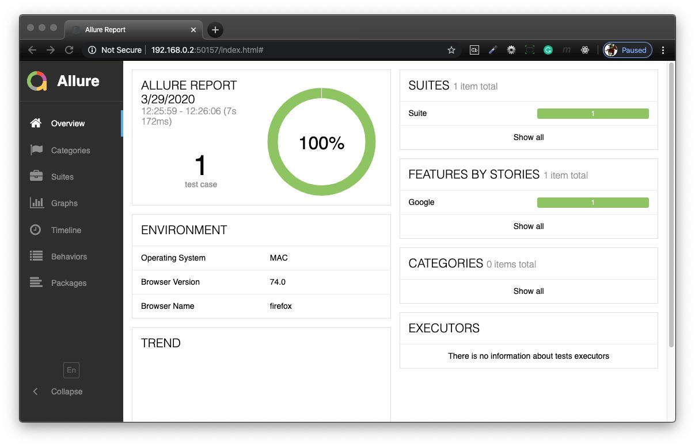

# automation-selenium

      

## Adding Allure Reporting to Automation
Allure Framework is a flexible lightweight multi-language test report tool that shows a very concise representation of what have been tested in a neat web report form.

### Reference
- [Allure Framework](https://docs.qameta.io/allure/)

### Running the Test
To run the test;
- download webdriver and note the path, provide the path on the java test file and save.
- right click the __testNG.xml__ file, and then select __Run As > TestNG Suite__.
- input command __allure serve allure-results__ to generate an Allure Report.
- for troubleshooting place __categories.json__ file into the folder __allure-results__.

### Results of Allure Report

#### [Return: Automation Selenium README](../README.md)