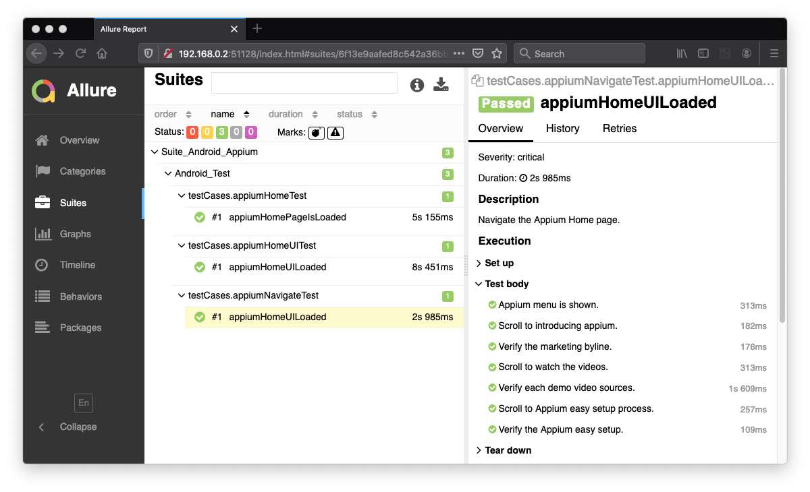

# automation-selenium

      

## Android Appium Web Automation
There are many different tools that help you inspect elements in mobile apps, the most popular and widely used tools (and supported by Android or Appium). These tools are –
- UIAutomatorViewer: This is a tool provided by Android Studio that lets you inspect elements in your mobile app
- Appium Desktop Inspector: The latest version of Appium GUI (Appium Desktop) comes with an inspector. You can use this inspector for both Android and iOS apps.

### Reference
- [Android Developers: UI Automator](https://developer.android.com/training/testing/ui-automator)
- [Medium: Inspect an app with the new Appium Desktop)](https://medium.com/@eliasnogueira/inspect-an-app-with-the-new-appium-desktop-8ce4dc9aa95c)

### Running the Test
To run the test;
- download webdriver and note the path, provide the path via Appium GUI.
- launch either Android Emulator or Android Device depending on setup.
- right click the __testNG.xml__ file, and then select __Run As > TestNG Suite__.

### Allure Report for Appium Test

#### [Return: Automation Selenium README](../README.md)