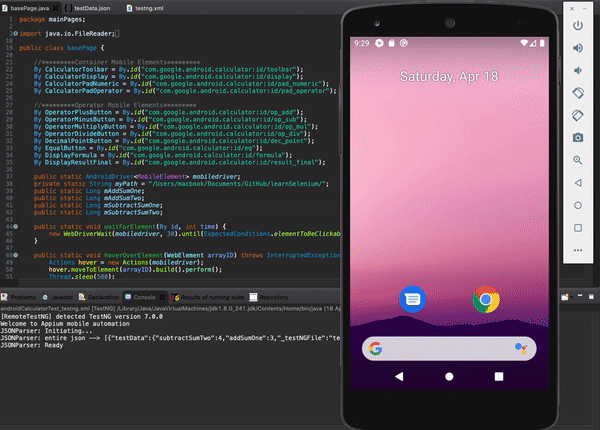
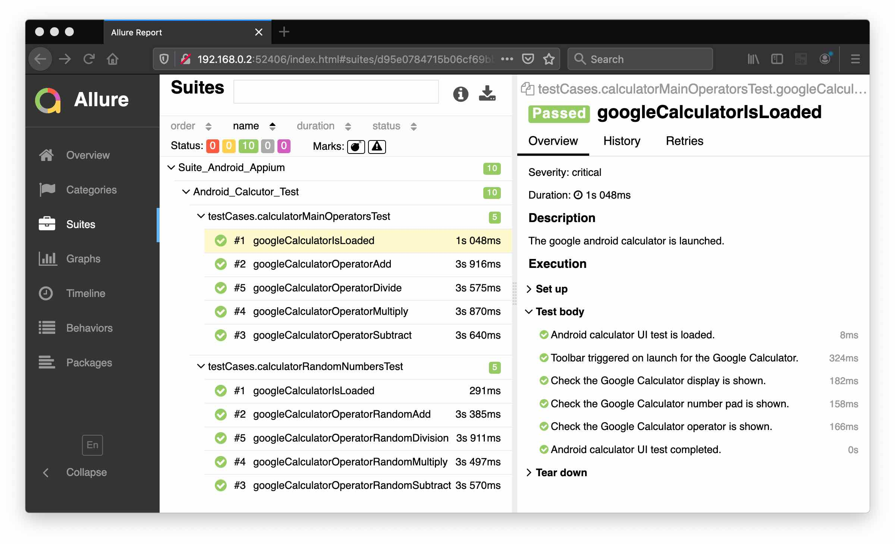

# automation-selenium

      

## Google Calcultor App Automation
Use Android mobile phone's default installed Calculator app to run Appium software automation test script. This sample provides a Android TestNG based test project that can be imported as a Maven project on Eclipse or Intellij IDE.
- deviceName & udid: Connect your android device with PC and get device name by running adb devices command in command prompt.
- platformVersion: In the android device, Open settings -> About phone -> Android version.
- appPackage: Package name for the calculator app is com.android.calculator2.
- appActivity: Activity name for the calculator app is com.android.calculator2.Calculator.

### Reference
- [Google: Android Calculator](https://play.google.com/store/apps/details?id=com.google.android.calculator&hl=en_GB)

### Running the Test
To run the test;
- install Google Calculator .apk to either Android Emulator or Android Device.
- right click the __testNG.xml__ file, and then select __Run As > TestNG Suite__.

### Allure Report for Calculator Test

#### [Return: Automation Selenium README](../README.md)