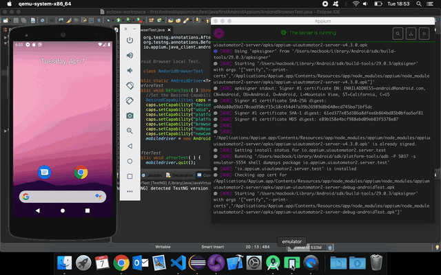

# automation-selenium

      

## First Android Appium Automation
With Appium, you would need to write automation test scripts that interact with the screens and controls (buttons, text boxes etc) in your mobile app and perform actions on them. We would use Java to write these automation scripts.
- Step 1: Java Installation and Setup
  - Download and Install latest version of Java (JDK)
  - Setup Java Environment Variables
- Step 2: Android Installation and Setup
  - Download and Install Appium Desktop App
  - Install additional Android SDK tools
  - Setup Android Environment Variables
- Step 3: Appium tool setup
  - Download and Install Appium Desktop App
  - Download and Install Eclipse IDE for Java
  - Turn On USB Debugging on your Android Device
  - Create new project in Eclipse for Appium
- Step 4: ChromeDriver setup
  - Download Chromedriver
  - Add path to Appium Desktop App

### Reference
- [Appium: Mobile App Automation Made Awesome.](http://appium.io/)
- [Tutorial: Automated Testing on Android (with Appium, TestNG and Java on Mac)](https://medium.com/2359media/tutorial-automated-testing-on-android-and-ios-with-appium-testng-and-java-on-mac-210119edf323)

### Running the Test
To run the test;
- download webdriver and note the path, provide the path via Appium GUI.
- launch either Android Emulator or Android Device depending on setup.
- right click the __testNG.xml__ file, and then select __Run As > TestNG Suite__.

### Automating Android Emulator

#### [Return: Automation Selenium README](../README.md)