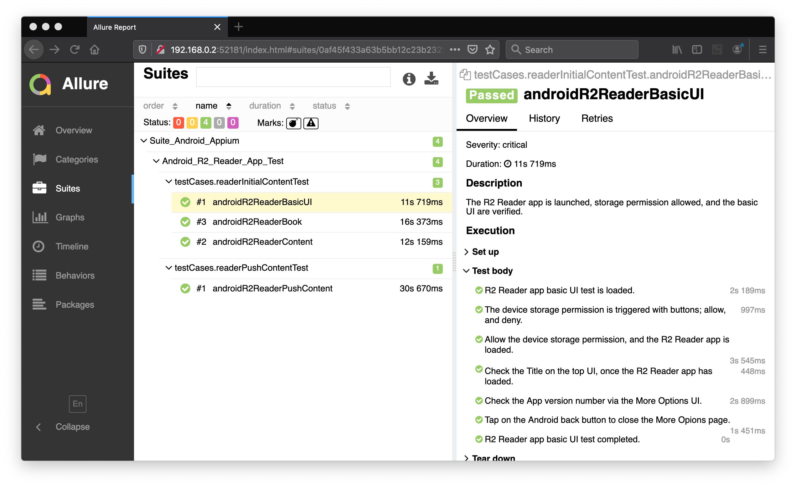

# automation-selenium

[](https://www.selenium.dev/) [](hhttps://maven.apache.org/) [](https://www.eclipse.org/) [](https://www.java.com/en/) [](https://testng.org/doc/index.html) [](https://appium.io/) [](https://www.android.com/intl/en_uk/)

## R2 Reader App Automation
Use free reading application (open-source Readium-2 architecture) to run Appium software automation test script. This sample provides a Android TestNG based test project that can be imported as a Maven project on Eclipse or Intellij IDE.
- deviceName & udid: Connect your android device with PC and get device name by running adb devices command in command prompt.
- platformVersion: In the android device, Open settings -> About phone -> Android version.
- appPackage: Package name for the R2 Reader app is org.readium.r2reader.
- appActivity: Activity name for the R2 Reader app is org.readium.r2.testapp.CatalogActivity.

### Reference
- [Google Play: R2 Reader](https://play.google.com/store/apps/details?id=org.readium.r2reader)

### Running the Test
To run the test;
- install R2 Reader .apk to either Android Emulator or Android Device.
- right click the __testNG.xml__ file, and then select __Run As > TestNG Suite__.

### Results of Allure Report


### String Formatter Function
```java
...
public static String capitaliseWord(String str){
  // remove file extension ".epub"
  String str2 = str.replaceAll("(_|.epub)", " ");
    // split string into individual string value
    String words[] = str2.split("\\s");  
    String capitaliseWord = "";
    // apply uppercase to first string value
    for(String w:words){  
        String first = w.substring(0,1);  
        String afterfirst = w.substring(1);  
        capitaliseWord += first.toUpperCase() + afterfirst + " ";  
    }
    // retunr split string value as one
    return capitaliseWord.trim();  
}
...
```

#### [Return: Automation Selenium README](../README.md)