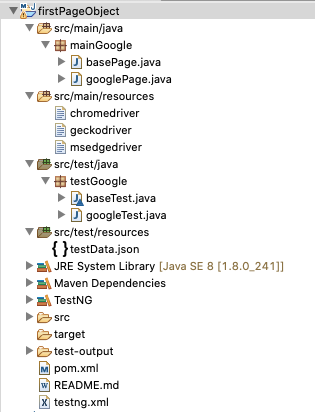

# automation-selenium

      

## Adding Page Object Model
Creating Selenium test cases can result in an unmaintainable project leading to too many duplicated code been used. By using the page object model it can reduce or eliminate duplicate test code, improves the readability, and create tests with less keystroke.

### Reference
- [Page Object Model (POM) & Page Factory: Selenium WebDriver Tutorial](https://www.guru99.com/page-object-model-pom-page-factory-in-selenium-ultimate-guide.html)

### Advantages of Page Object Model Framework
- Code reusability – Code reusability by writing the code once and use it in different tests.
- Code maintainability – There is a clean separation between test code and page specific code such as locators and layout which becomes very easy to maintain code. Code changes only on Page Object Classes when a UI change occurs. It enhances test maintenance and reduces code duplication.
- Object Repository – Each page will be defined as a java class. All the fields in the page will be defined in an interface as members. The class will then implement the interface.
- Readability – Improves readability due to clean separation between test code and page specific code

### Introduction
Here I will take Google Search Application to showcase implementation of Page Object Model Design Pattern using Selenium with Java.

Scenario: Enter valid string from the .json file in the "Google Search" Page and redirects to the "Results" Page.

### Structure of the Maven Project

### Running the Test
To run the test;
- download webdriver and note the path, provide the path on the java test file and save.
- right click the __testNG.xml__ file, and then select __Run As > TestNG Suite__.

#### [Return: Automation Selenium README](../README.md)