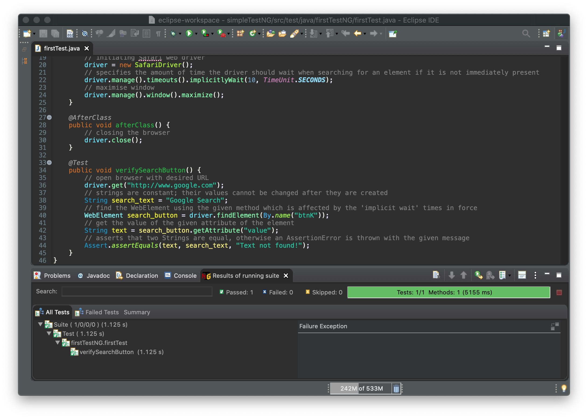

# automation-selenium

[](https://www.selenium.dev/) [](hhttps://maven.apache.org/) [](https://www.eclipse.org/) [](https://www.java.com/en/) [](https://testng.org/doc/index.html)

## Automation with TestNG
TestNG is one of the most widely used open source testing framework used in automation testing suite.

### Reference
- [TestNG Tutorial: Annotations, Framework, Examples in Selenium](https://www.guru99.com/all-about-testng-and-selenium.html)

### Introduction
Create a script with TestNG implementation that would:
- fetch Google Search homepage
- verify its title
- print out the result of the comparison
- close it before ending the entire program

### Running the Test
To run the test, simply right click the __testNG.xml__ file, and then select __Run As > TestNG Suite__. Eclipse will provide two outputs; one in the Console window, and the other on the TestNG Results window.

### Results of running suite


### TestNG: Assertions
TestNG provides multiple level assertions to validate your actual results against your expected results. Few of the commonly used assertions are:
- assertTrue: this assertion verifies whether the defined condition is true or not. If true, it will pass the test case. If not, it will fail the test case.
```java
Assert.assertTrue(condition);
```
- assertFalse: this assertion verifies whether the defined condition is false or not. If false, it will pass the test case. If not, it will fail the test case.
```java
Assert.assertFalse(condition);
```
- assertEquals: this assertion compares the expected value with the actual value. If both are the same, it passes the test case. If not, it fails the test case. You can compare strings, objects, integer values etc. using this assert.
```java
Assert.assertEquals(actual,expected);
```
- assertNotEquals: this is just opposite to what assertEquals does. If actual matches the expected, the test case fails, else the test case passes.
```java
Assert.assertNotEquals(actual,expected,Message);
```

> **_NOTE:_**  An important part to note in assertions is that your tests will not execute to the next line of code if your assertions failed. It will automatically jump to the next test annotated method.

#### [Return: Automation Selenium README](../README.md)