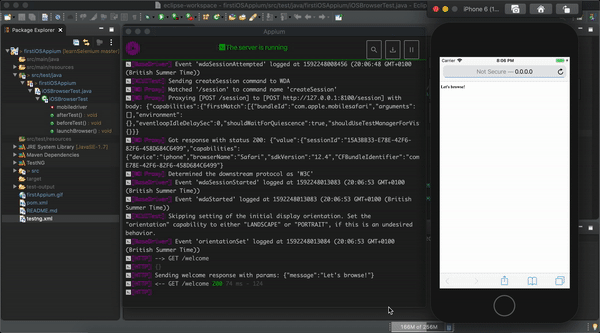

# automation-selenium

      

## First iOS Appium Automation
With Appium, you would need to write automation test scripts that interact with the screens and controls (buttons, text boxes etc) in your mobile app and perform actions on them. We would use Java to write these automation scripts.
- Step 1: Java Installation and Setup
  - Download and Install latest version of Java (JDK)
  - Setup Java Environment Variables
- Step 2: Required Packages for iOS Testing
	- Install Maven
  - brew install libimobiledevice
  - brew install ios-deploy
- Step 3: WebDriverAgent setup
	- cd /Applications/Appium.app/Contents/Resources/app/node_modules/appium/node_modules/appium-webdriveragent
	- mkdir -p Resources/WebDriverAgent.bundle
	- ./Scripts/bootstrap.sh
	- Launch project in Xcode and assign automatically signing
- Step 4: Appium tool setup
  - Download and Install Appium Desktop App
  - Download and Install Eclipse IDE for Java
  - Create new project in Eclipse for Appium

### Reference
- [Appium: Mobile App Automation Made Awesome.](http://appium.io/)
- [iOS Testing Using Appium and JAVA | iOS Mobile Test Automation](https://www.swtestacademy.com/ios-testing-appium-java/)

### Running the Test
To run the test;
- launch Appium GUI and click on the Start Server button.
- right click the __testNG.xml__ file, and then select __Run As > TestNG Suite__.

### Automating iOS Emulator

#### [Return: Automation Selenium README](../README.md)