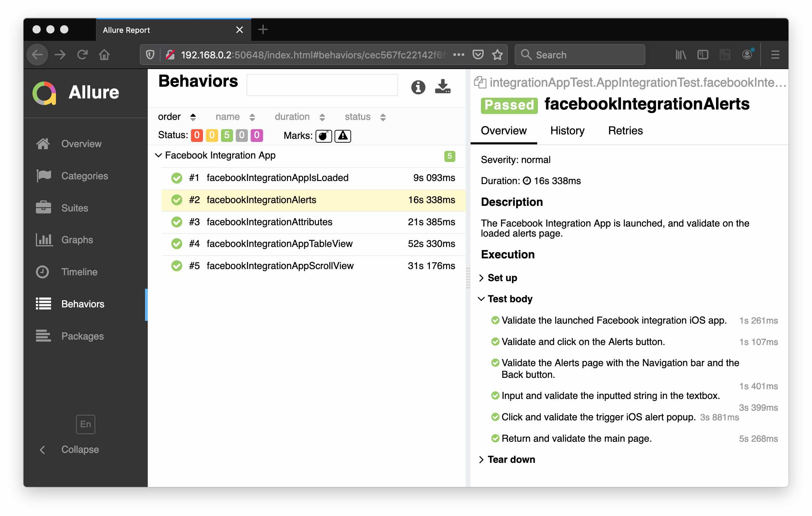

# automation-selenium

      

## iOS Facebook Integration App Automation
XCUITest driver installs a helper application called WebDriverAgent-Runner onto the device, and handles the application under test via it.

### Reference
- [GitHub: appium-xcuitest-driver](https://github.com/appium/appium-xcuitest-driver)
- [Appium XCUITest Driver Real Device Setup](http://appium.io/docs/en/drivers/ios-xcuitest-real-devices/#appium-xcuitest-driver-real-device-setup)
- [Scrolling on iOS – Using Appium](https://developers.perfectomobile.com/pages/viewpage.action?pageId=25199704)
- [Java – SimpleDateFormat](https://docs.oracle.com/javase/7/docs/api/java/text/SimpleDateFormat.html)
- [How to Automate Picker Wheel Controls](https://appiumpro.com/editions/59-how-to-automate-picker-wheel-controls)

### Running the Test
To run the test;
- install and launch __com.facebook.IntegrationApp__ via Xcode.
- launch Appium GUI and click on the Start Server button.
- right click the __testNG.xml__ file, and then select __Run As > TestNG Suite__.

### Allure Report

#### [Return: Automation Selenium README](../README.md)